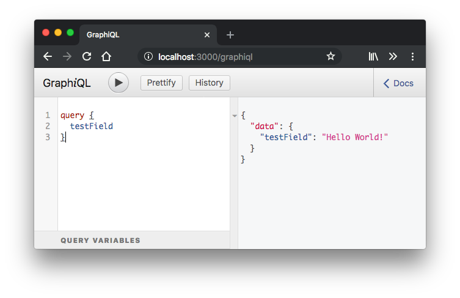
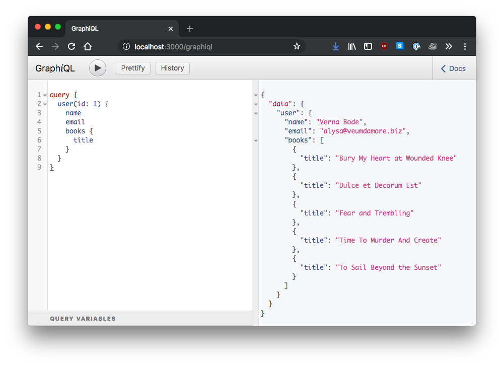

## Setting up a Rails API

First, we're going to create a new api-only Rails app for our backend. I'm gonna skip testing for now for the sake of this tutorial. Next, create a couple models to test data with.

```
rails new graphql_api --skip-test --api
rails g model User email:string name:string
rails g model Book user:belongs_to title:string
rails db:migrate
```

Open `app/models/user.rb` and add the `has_many :books` association.
Optionally, create some seed data using the `faker` gem in `seeds.rb`, then run `rake db:seed`.

[View commit](https://github.com/mattboldt/rails_graphql_demo/commit/2dfe3298f153d2d43ed1e602d4ecefd23cc0462c)

## Installing dependencies

```ruby
# Gemfile

# The ruby implementation of the GraphQL language.
gem 'graphql'

# Will enable us to send API requests via AJAX to the Rails server.
gem 'rack-cors'

group :development do
  # A development utility to test GraphQL queries.
  gem 'graphiql-rails'

  # Seed data generator
  gem 'faker'
end
```

### Generating the GraphQL files

```
rails generate graphql:install
bundle
rails generate graphql:object user
rails generate graphql:object book
```

These generators create a `graphql` directory with types, mutations, and a schema. We also want to generate new custom types for our `user` and `book` models we created above.

```diff
  ├─ controllers
+ │  └─ graphql_controller.rb
+ ├─ graphql
+ │  ├─ mutations
+ │  ├─ rails_graphql_demo_schema.rb
+ │  └─ types
+ │     ─ base_enum.rb
+ │     ─ base_input_object.rb
+ │     ─ base_interface.rb
+ │     ─ base_object.rb
+ │     ─ base_scalar.rb
+ │     ─ base_union.rb
+ │     ─ book_type.rb
+ │     ─ mutation_type.rb
+ │     ─ query_type.rb
+ │     ─ user_type.rb
```

The generator also adds a new `POST` endpoint to our routes, but we also want to add the endpoint for the `graphiql-rails` interface we added above.

```ruby
# routes.rb

Rails.application.routes.draw do
  if Rails.env.development?
    mount GraphiQL::Rails::Engine, at: "/graphiql", graphql_path: "graphql#execute"
  end
  post "/graphql", to: "graphql#execute"
end

```

[View commit](https://github.com/mattboldt/rails_graphql_demo/commit/0c9b56aa4b0aea178856aebd5832337763826daf)

### Enabling `rack-cors`

After installing `rack-cors`, we need to uncomment the config in `config/initializers/cors.rb`. This will allow AJAX requests to be accepted by our API with proper [CORS headers](https://developer.mozilla.org/en-US/docs/Web/HTTP/CORS). Keep in mind this config will need to be set up differently in a production environment.

[View commit](https://github.com/mattboldt/rails_graphql_demo/commit/693f5f40dae3aecdc7d7c16f3632aeb153b2f83d)


### Testing queries with Graphiql

The final step to get `graphiql` running is to uncomment `require "sprockets/railtie"` in `application.rb`. Boot up your rails server with `rails s` and navigate to `http://localhost:3000/graphiql` to see the interface. Here we can run the following query to get a test response from the API.



[View commit](https://github.com/mattboldt/rails_graphql_demo/commit/8253186e052bc1ebd02ccf8524cd19f32c22597f)

## Model Query Types

For our models, `User` and `Book`, we need to create a series of `types` so GraphQL knows what kind of data to send back in the event of a request. Somewhat similar to Rails' [active_model_serializers](https://github.com/rails-api/active_model_serializers) or JBuilder, these types make up the structure of our models from the API's point of view. Here we'll specifiy what columns, model methods, and more return to the client application. [More info on declaring types can be found here.](http://graphql-ruby.org/getting_started#declare-types)

### User and Book query types

Open up our generated types and add the following fields. Notice each field gets a type and a `null` option of whether or not it needs to be present for the query to succeed. This tells graphql what to expect from incoming and outgoing data, and gives us peace of mind in knowing exactly how to parse data on both the front and back end.

```ruby
# app/graphql/types/user_type.rb
module Types
  class UserType < Types::BaseObject
    field :id, ID, null: false
    field :name, String, null: true
    field :email, String, null: true
    field :books, [Types::BookType], null: true
    field :books_count, Integer, null: true

    def books_count
      books.size
    end
  end
end


# app/graphql/types/book_type.rb
module Types
  class BookType < Types::BaseObject
    field :title, String, null: false
  end
end
```

### The main query type

A `query` in graphql is similar to regular `GET` requests in a Rails API. Queries only fetch data, but do not update it. For creating/updating/destroying, a `mutation` is used, but we'll cover that later. In our main query type, we specify some new "endpoints" along with what data to return.

```ruby
# app/graphql/types/query_type.rb
module Types
  class QueryType < Types::BaseObject

    field :users, [Types::UserType], null: false

    def users
      User.all
    end

    field :user, Types::UserType, null: false do
      argument :id, ID, required: true
    end

    def user(id:)
      User.find(id)
    end
  end
end
```
[View commit](https://github.com/mattboldt/rails_graphql_demo/commit/e062713d17f8fb65c9d0a4cb31a4014cf795376a)

### Testing queries with `graphiql`

Visit `http://localhost:3000/graphiql` in your browser and paste in the following for the `users` and `user` query fields we added above. Here we specify exactly what we want the API to respond with; in this case, we only want a list of user names, emails, and the number of books they own.

```gql
query {
  users {
    name
    email
    booksCount
  }
}
```

We can also query a single user, along with all of their books, and each book's title.

```gql
query {
  user(id: 1) {
    name
    email
    books {
      title
    }
  }
}
```



## Mutations

Mutations allow for creating, updating, and destroying data. [More info on them can be found here.](http://graphql-ruby.org/mutations/mutation_classes) Let's set up a base class from which to extend a `CreateUser` mutation.

```ruby
# app/graphql/mutations/base_mutation.rb
class Mutations::BaseMutation < GraphQL::Schema::RelayClassicMutation
end
```


- **Arguments** - Here we specify which arguments to accept as params, which are required, and what object types they are. This is somewhat similar to defining strong params in a Rails controller, but with more fine grained control of what's coming in.
- **Fields** - The field methods are what get returned to the client. In our case, we accepted arguments to create a user, and we want to return a `user` field with our new model accompanied with an array of `errors` if present.
- **Resolver** - The `resolve` method is where we execute our ActiveRecord commands. It returns a hash with keys that match the above field names. 

```
# app/graphql/mutations/create_user.rb
class Mutations::CreateUser < Mutations::BaseMutation
  argument :name, String, required: true
  argument :email, String, required: true

  field :user, Types::UserType, null: false
  field :errors, [String], null: false

  def resolve(name:, email:)
    user = User.new(name: name, email: email)
    if user.save
      # Successful creation, return the created object with no errors
      {
        user: user,
        errors: [],
      }
    else
      # Failed save, return the errors to the client
      {
        user: nil,
        errors: user.errors.full_messages
      }
    end
  end
end
```

Then finally, add the new mutation to the main mutation type class so it's exposed to our API.

```ruby
# app/graphql/types/mutation_type.rb
module Types
  class MutationType < Types::BaseObject
    field :create_user, mutation: Mutations::CreateUser
  end
end
```

To test, open up `graphiql` and paste in the following:

```gql
mutation CreateUser {
  createUser(input: {
    name: "Bob",
    email: "bob@email.com"
  }) {
 	user {
      id
      name
      email
    }
    errors
  }
}
```

