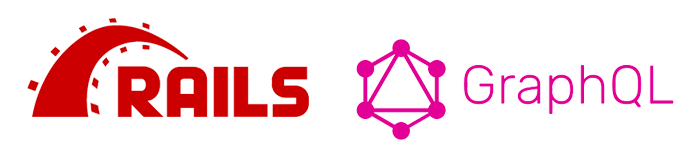

# Rails, React, & GraphQL (Part 2)



This is a continuation of [Rails & GraphQL Part 1](https://mattboldt.com/2019/01/07/rails-and-graphql/), where we built the backend of our API in rails. This article will cover integrating React and Apollo (a JavaScript GraphQL framework) into the rails API. If you haven't read part 1 yet, please do so now!

## Rails API Setup

In order to use React with rails, we need to make some changes to the API.

```ruby
# Gemfile
gem 'rack-cors'
```

Then, open up `application.rb` and add the following settings. This will allow us to accept AJAX requests coming from React.

```ruby
# config/application.rb
# CORS config to allow ajax
config.middleware.insert_before 0, Rack::Cors do
  allow do
    origins '*'
    resource '*', headers: :any, methods: [:get, :post, :options]
  end
end
```

## React

In the Rails app folder, we're going to create a new react app using `create-react-app`. [See their README for setup guides](https://github.com/facebook/create-react-app). I'm using `yarn` here, but you can use `npm` if you'd like.

We're also going to install Apollo: `react-apollo` is a React-specific library for using Apollo in components,  `apollo-boost` contains many utilities and libraries for Apollo to get you set up quickly, and finally the javascript `graphql` library itself.

```
create-react-app frontend
cd frontend
yarn add apollo-boost react-apollo graphql
yarn start
```

[View Commit](https://github.com/mattboldt/rails_graphql_demo/commit/5ae44f8607207c9eba439b1639b6273b7572d56c)

